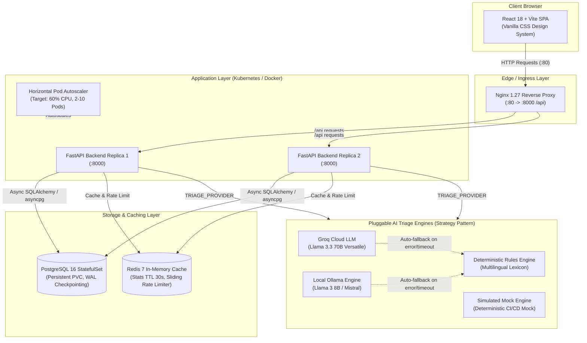

# CivicPulse — AI-Assisted Municipal Complaint Intake & Triage Platform

[](https://github.com/hussainali-code/CivicPulse/actions/workflows/ci.yml)
[](https://github.com/hussainali-code/CivicPulse/actions/workflows/cd.yml)
[](https://opensource.org/licenses/MIT)
[](https://www.python.org/)
[](https://nodejs.org/)
[](https://github.com/astral-sh/ruff)
[](https://mypy-lang.org/)

CivicPulse is an automated municipal complaint intake and AI triage platform designed for modern civic governance in Pakistani municipalities. It delivers sub-second automated categorization, priority assignment, SLA routing, and localized multilingual triage (English, Urdu, and Roman Urdu), backed by a cloud-native architecture resilient to network partitions and hardware failures.

Built for **CS4032 – Software Construction and Design (Assignment 01)**.

---

## 1. System Architecture



---

## 2. Team Members & Responsibilities

| Member | Focus Areas & Work Distribution |
|---|---|
| **Member A** (`hussainali-code`) | Lead Architecture, Git Setup & Branch Protection, Database Schema (Postgres + Alembic), Docker Compose Core, K8s Base Manifests (Deployments, StatefulSets, HPA), GitHub Actions CI Pipeline (`ci.yml`), ADRs 0001 & 0003, HPA Load Testing & Metrics Plotting |
| **Member B** (`Ahsan Khalid`) | API Route Controllers, Pluggable AI Triage Engines (Groq LLM + Ollama), Redis Caching & Rate Limiting, React 18 SPA (Intake Form, Dashboard, Analytics), Nginx Reverse Proxy, K8s Overlays (`dev`, `prod`), GitHub Actions CD & Release Pipelines (`cd.yml`, `release.yml`), ADRs 0002 & 0004 |

---

## 3. One-Command Quickstart (Clean Clone)

CivicPulse is designed to bootstrap deterministically from a completely clean workspace with a single command.

### Step 1: Clone the Repository
```bash
git clone https://github.com/hussainali-code/CivicPulse.git
cd CivicPulse
```

### Step 2: Configure Environment
```bash
cp .env.example .env
```
*(The default `.env.example` is fully operational out-of-the-box using the high-speed `simulated` or `rules` triage provider without requiring third-party API keys).*

### Step 3: Launch with Docker Compose
```bash
docker compose up -d --build
```

### Step 4: Verify Services
- **Citizen Portal (Frontend):** [http://localhost](http://localhost)
- **Interactive API Documentation (Swagger):** [http://localhost:8000/docs](http://localhost:8000/docs)
- **Liveness Health Check:** [http://localhost:8000/health](http://localhost:8000/health)
- **Readiness Probe:** [http://localhost:8000/ready](http://localhost:8000/ready)
- **Prometheus Metrics:** [http://localhost:8000/metrics](http://localhost:8000/metrics)

To shut down and wipe ephemeral volumes:
```bash
docker compose down -v
```

---

## 4. API Endpoint Reference

| Method | Endpoint | Description | Rate Limited | Auth / Cache |
|---|---|---|---|---|
| `POST` | `/api/complaints` | Submit a new citizen complaint. Auto-triages category, priority, and summary. | Yes (10/min/IP) | Enforces PII stripping & input validation |
| `GET` | `/api/complaints` | Paginated complaint listing with category, priority, and status filters. | Yes (60/min/IP) | Database indexed |
| `GET` | `/api/complaints/{id}` | Retrieve full details and triage outcome for a specific complaint. | Yes (60/min/IP) | UUID path parameter |
| `PATCH`| `/api/complaints/{id}/status` | Transition complaint lifecycle status (`new` → `in_progress` → `resolved`). | Yes (30/min/IP) | Validates state machine; returns 409 on invalid transition |
| `GET` | `/api/stats` | Aggregated breakdown by category and status. | Yes (60/min/IP) | **Redis Cached (30s TTL)**; returns `X-Cache: HIT/MISS` header |
| `GET` | `/api/meta/providers` | Metadata on active triage provider and last 20 classification outcomes. | Yes (60/min/IP) | Operational observability |
| `GET` | `/health` | Kubernetes **Liveness Probe**. Returns 200 OK without touching DB or cache. | No | Light probe; prevents cascading restarts |
| `GET` | `/ready` | Kubernetes **Readiness Probe**. Deep checks PostgreSQL and Redis connectivity. | No | Removes unready pods from Service endpoints |
| `GET` | `/metrics` | Prometheus format metrics (HTTP request counts, latency histograms, error rates). | No | Scraped by cluster monitoring |

---

## 5. User Interface & Feature Walkthrough

The frontend is a responsive Single Page Application built with React 18, Vite, and a custom CSS design system optimized for accessibility and low-latency interaction:

### View 1: Citizen Complaint Intake Form (`/`)
- Allows citizens to submit complaints with location details and auto-detected categories.
- Supports English, Urdu, and Roman Urdu descriptions.
- Instant submission feedback with assigned Tracking UUID, AI-assigned Category, Priority badge, and Executive Summary.
- Live client-side character validation and rate limit notification.

### View 2: Municipal Staff Triage Dashboard (`/dashboard`)
- Full operational dashboard displaying complaints in real-time.
- Interactive multi-parameter filtering: Filter by **Category** (`water`, `electricity`, `sanitation`, `roads`, `streetlights`), **Priority** (`low`, `medium`, `high`, `critical`), and **Status** (`new`, `in_progress`, `resolved`).
- In-place lifecycle transition buttons with strict conflict prevention: Displays server-provided HTTP 409 conflict messages if an invalid state transition is attempted.
- Collapsible triage metadata showing AI provider attribution (`groq`, `ollama`, `rules`, `simulated`) and confidence score.

### View 3: Real-Time Municipal Analytics & Cache Inspector (`/stats`)
- High-level KPIs: Total Complaints, Resolved Ratio, Critical Incident Queue.
- Visual status and category distribution metrics.
- **Live Cache Health Inspector:** Visual badge displaying `X-Cache: HIT` (green) or `X-Cache: MISS` (amber) with response time in milliseconds.
- Manual refresh trigger verifying Redis cache invalidation on new complaint submission.

---

## 6. Architecture Decision Records (ADRs)

CivicPulse documents its foundational architectural decisions using standardized ADR templates:

1. [**ADR 0001: Pluggable AI Triage Provider Interface**](file:///Users/macbookprom2/Desktop/SCD%20Assignment/civicpulse/adr/0001-provider-interface.md) — Structural subtyping via `typing.Protocol`, Open-Closed Principle, and fallback strategies.
2. [**ADR 0002: Frontend Runtime Configuration via Reverse Proxy**](file:///Users/macbookprom2/Desktop/SCD%20Assignment/civicpulse/adr/0002-runtime-config.md) — Nginx `/api` reverse proxying vs build-time baked environment variables.
3. [**ADR 0003: PostgreSQL StatefulSet & Deploy-by-SHA Strategy**](file:///Users/macbookprom2/Desktop/SCD%20Assignment/civicpulse/adr/0003-postgres-statefulset.md) — Stateful database persistence, VolumeClaimTemplates, and immutable Git SHA container tags.
4. [**ADR 0004: PII Governance & Data Minimization**](file:///Users/macbookprom2/Desktop/SCD%20Assignment/civicpulse/adr/0004-pii-and-data-governance.md) — Privacy protection, external LLM payload sanitization, and data retention policies.

---

## 7. Operational Runbook & Engineering Notes

- **Operational Runbook:** See [`docs/RUNBOOK.md`](file:///Users/macbookprom2/Desktop/SCD%20Assignment/civicpulse/docs/RUNBOOK.md) for deployment procedures, emergency rollbacks (`kubectl rollout undo`), logging standards, and incident response playbooks.
- **Engineering Notes:** See [`docs/ENGINEERING-NOTES.md`](file:///Users/macbookprom2/Desktop/SCD%20Assignment/civicpulse/docs/ENGINEERING-NOTES.md) for in-depth technical responses to all 8 evaluation questions with exact `file:line` code citations.
- **AI Usage Disclosures:** See [`docs/AI-USAGE.md`](file:///Users/macbookprom2/Desktop/SCD%20Assignment/civicpulse/docs/AI-USAGE.md) for complete logging of AI assistance, generated assets, and verification protocols.
- **AI Triage Benchmarks:** See [`docs/TRIAGE.md`](file:///Users/macbookprom2/Desktop/SCD%20Assignment/civicpulse/docs/TRIAGE.md) for comparative latency, accuracy, and caching analysis.

---

## 8. Verification & Pre-Flight Checks

Before committing or submitting, verify repository integrity against course rubrics:

```bash
python3 scripts/check_submission.py
```
This automated pre-flight checker validates forbidden files (ensuring no `.env` or credentials are in the git index), verifies Kubernetes StatefulSet requirements, inspects Docker Compose security, and checks directory completeness.
